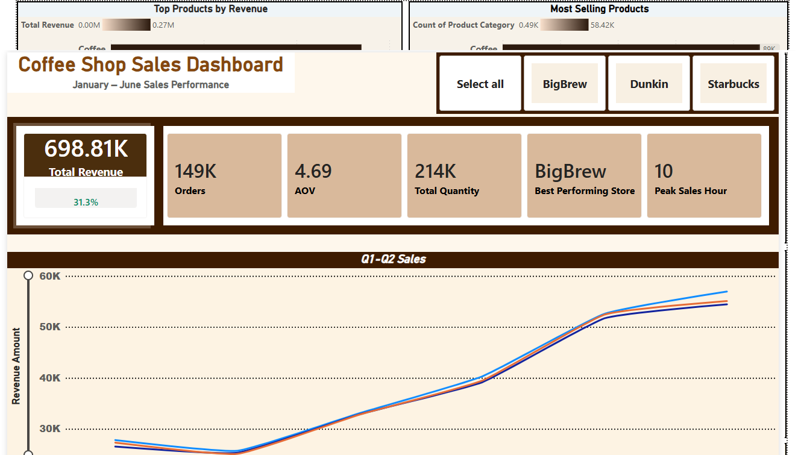
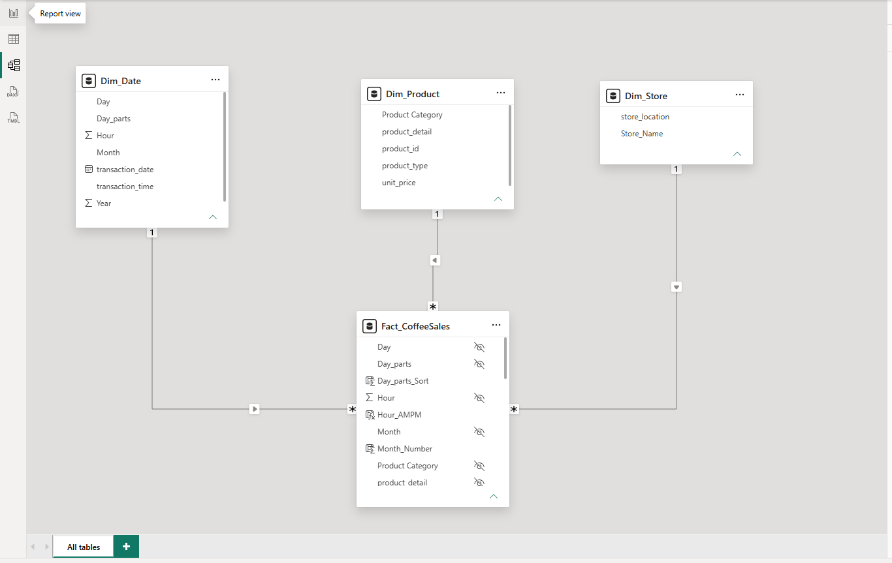
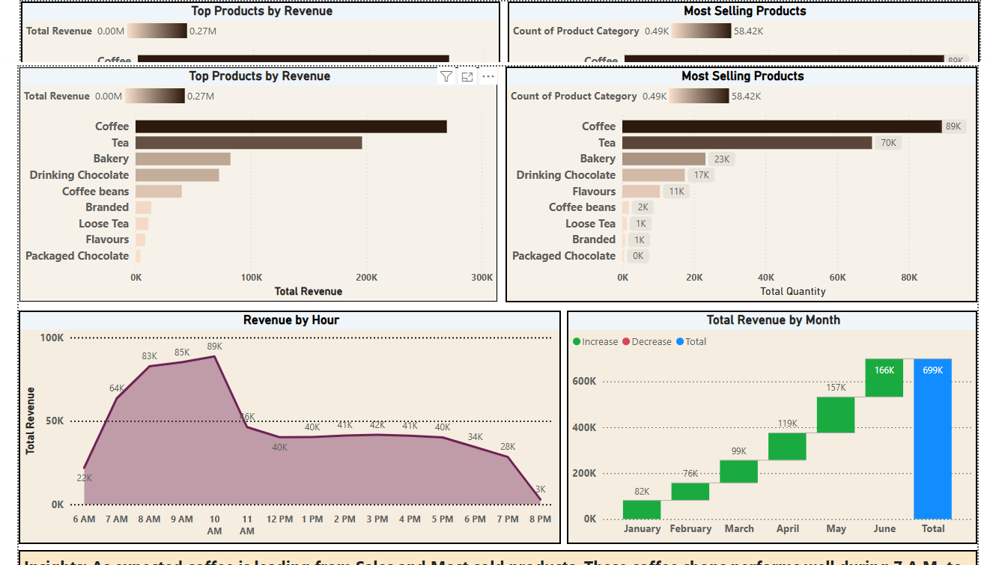
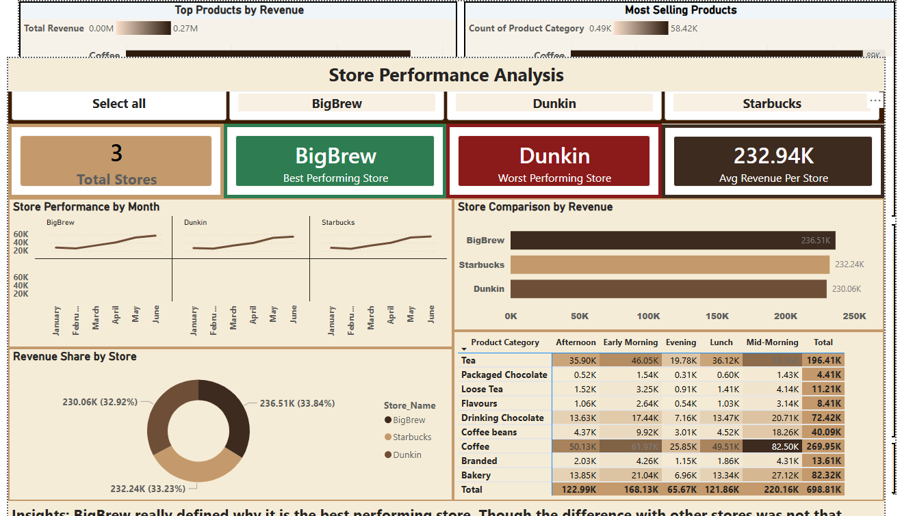

# ☕ Coffee Shop Sales Dashboard



## Project Overview
End-to-end data analytics project analyzing coffee shop sales performance across 3 stores from January to June 2023. This project analyzes transactional coffee shop sales data from three store locations using Python (Pandas), Excel, and Power BI to uncover insights into revenue performance, product sales, store performance, and customer purchasing behavior.

The objective was to transform raw transactional data into actionable insights through data cleaning, exploratory data analysis (EDA), KPI development, and interactive dashboard design.

## Results

The dashboard analyzed 149,116 transactions and generated the following business metrics:

- Total Revenue: 698.81K
- Total Orders: 149K
- Total Quantity Sold: 214K
- Average Order Value (AOV): 4.69
- Best Performing Store: BigBrew
- Peak Sales Hour: 10 AM

---

## Business Questions

This analysis was conducted to answer the following business questions:

- What time of day generates the highest sales volume and revenue?
- Which product categories contribute the most to total revenue?
- Which individual products are the top sellers?
- Which store location performs best in terms of revenue and order volume?
- How does sales performance vary across different months?
- What is the Average Order Value (AOV) of customer transactions?
- What purchasing patterns can be observed across different stores and time periods?
- Which categories or products may require additional marketing attention due to lower sales performance?

## Dataset
- **Source:** [Kaggle — Coffee Shop Sales](https://www.kaggle.com/)
- **Records:** 149,116 transactions
- **Period:** January 2023 – June 2023
- **Stores:** BigBrew, Dunkin, Starbucks

## Tools Used
- **Python (Pandas, NumPy)** — Data cleaning and preparation
- **Jupyter Notebook** — Analysis environment
- **Power BI** — Interactive dashboard and data modeling
- **DAX** — Business measures and KPIs
- **Star Schema** — Data modeling best practice

## Project Workflow

### 1. Data Cleaning (Jupyter/Python)
- Built a reusable cleaning pipeline using Python functions
- Stripped whitespace from all text columns
- Mapped store IDs to store names
- Mapped store locations to Philippine regions
- Created new columns: Month, Year, Hour, Day, Day_parts, Total_Amount
- Applied categorical ordering for correct sorting in Power BI
- Validated data quality — no nulls, no duplicates

### 2. Data Modeling (Power BI)
- Built a proper **Star Schema** with 4 tables
- **Fact table:** Fact_CoffeeSales (transactions)
- **Dimension tables:** Product, Store, Date
- Created relationships between all tables

### 3. DAX Measures
- Total Revenue
- Orders
- AOV (Average Order Value)
- Total Quantity
- Best Performing Store
- Worst Performing Store
- Average Revenue Per Store
- Revenue MoM %

### 4. Dashboard (3 Pages)

**Page 1 — Sales Overview**
- Monthly sales performance by store
- KPI cards for key metrics
- Store slicer for interactive filtering

**Page 2 — Product & Time Analysis**
- Top products by revenue and quantity
- Revenue by hour (area chart)
- Waterfall chart for monthly revenue
- Day-parts heat map matrix

**Page 3 — Store Performance**
- Store comparison by revenue
- Small multiples by month
- Revenue share donut chart
- Day-parts by product category matrix

## Data Model

The dashboard was built using a star schema data model consisting of:

- Fact_CoffeeSales
- Dim_Date
- Dim_Product
- Dim_Store

One-to-many relationships were established between the dimension tables and the fact table to support efficient filtering, aggregation, and reporting.

---

## Dashboard Features

- Interactive store filtering using slicers
- Revenue trend analysis by month
- Product category performance tracking
- Store comparison analysis
- Time-of-day sales analysis
- KPI monitoring through dynamic cards

## Key Insights
- **BigBrew** consistently leads all stores in revenue
- **Mid-Morning (9–10 AM)** is the peak sales period
- **Coffee category** dominates revenue across all stores
- Consistent **upward sales trend** from February to June
- All three stores perform similarly — revenue gap is less than 3%

---

## Dashboard Screenshots

### Page 2 — Product & Time Analysis


### Page 3 — Store Performance


## Power BI Dashboard

The complete Power BI dashboard file (`Coffee_Shop_Dashboard.pbix`) is included in this repository and can be opened using Power BI Desktop.

---

## Skills Demonstrated

- Data Cleaning
- Data Transformation
- Exploratory Data Analysis (EDA)
- DAX Measures
- KPI Development
- Power BI Dashboard Design
- Business Intelligence
- Data Visualization

## Project Structure

```text
coffee-shop-sales-dashboard/
│
├── page1_sales_overview.png
├── page2_product_time.png
├── page3_store_performance.png
└── model_view.png
│
├── Coffee_Project101.ipynb
├── Coffee Shop Sales.xlsx
├── coffee_sales_cleaned.csv
├── Coffee_Shop_Dashboard.pbix
└── README.md
```

---

## Future Improvements

- Sales Forecasting
- Customer Segmentation
- Inventory Analysis
- SQL Integration
- Advanced DAX Measures

## How to Run
1. Clone this repository
2. Open `Coffee_Project101.ipynb` in Jupyter Notebook
3. Run all cells to reproduce the cleaning pipeline
4. Open `Coffee_Shop_Dashboard.pbix` in Power BI Desktop
